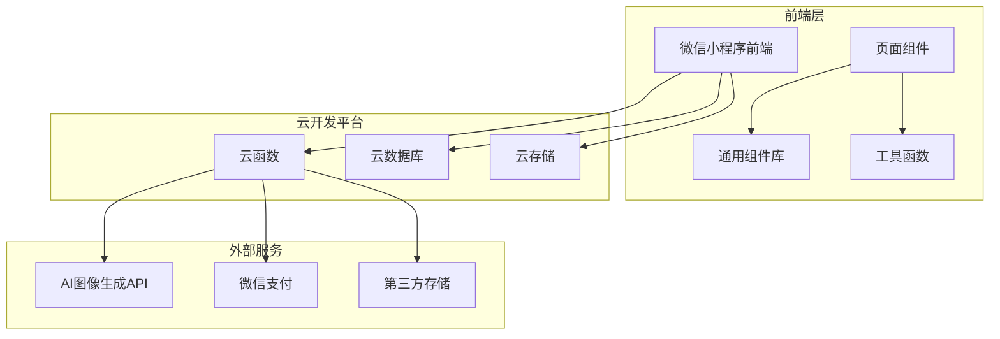
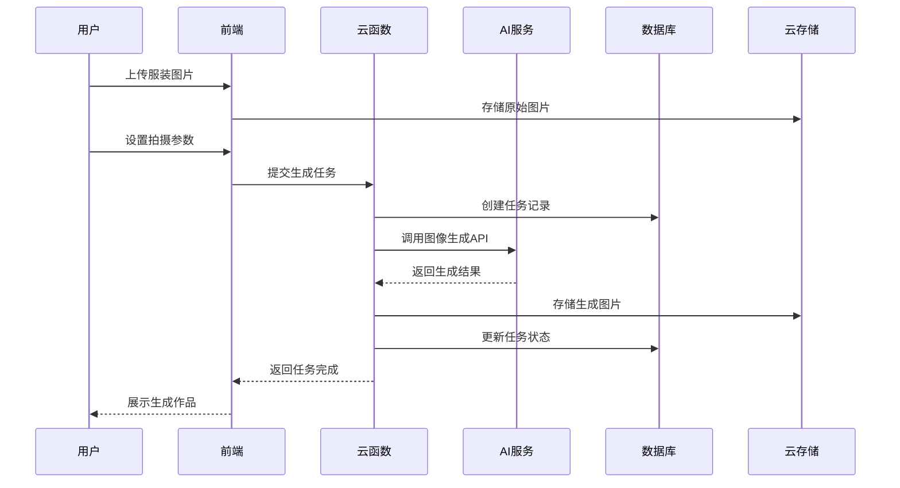
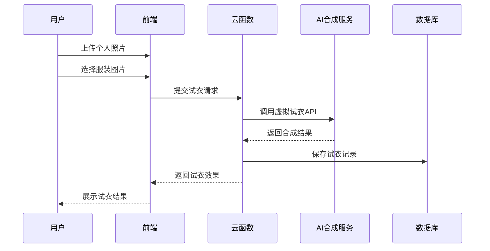
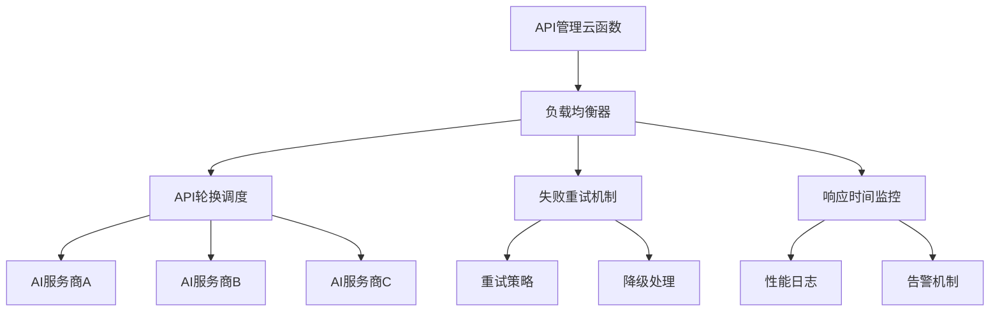
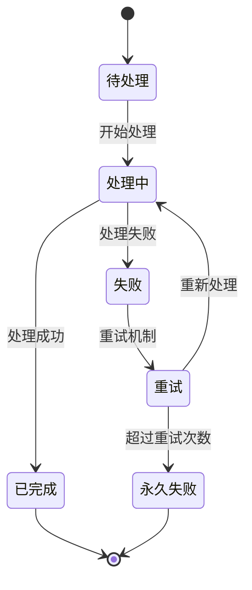
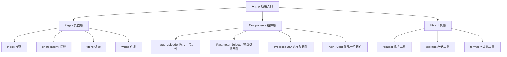
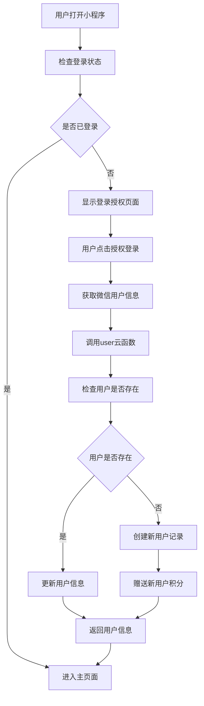
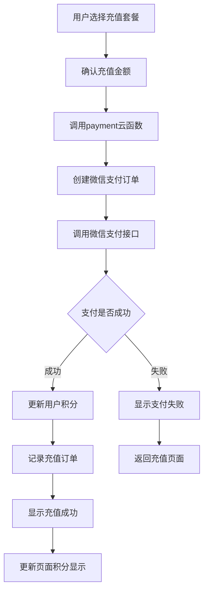
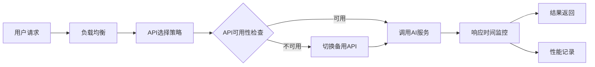

# AI摄影师微信小程序设计文档

## 1. 项目概述

### 1.1 项目定位
AI摄影师微信小程序是一个基于微信云开发的AI图像生成平台，专注于服装摄影和虚拟试衣功能。用户可以通过上传服装图片和设置参数，利用AI技术生成专业的服装摄影作品，同时提供虚拟试衣体验。

### 1.2 核心价值
- **专业摄影效果**：利用AI技术生成专业级服装摄影作品
- **成本效益**：降低传统摄影成本，提供经济实惠的创作方案
- **便捷操作**：简化摄影流程，用户只需上传图片和设置参数
- **商业变现**：积分制付费模式，可持续的商业模式

### 1.3 目标用户
- 服装电商商家
- 个人服装销售者
- 时尚博主和内容创作者
- 对虚拟试衣有需求的消费者

## 2. 技术架构

### 2.1 整体架构

### 2.2 前端架构

| 技术栈 | 描述 |
|--------|------|
| 开发框架 | 微信小程序原生开发 |
| UI设计 | 现代简约风格，白色主色调配渐变蓝色品牌色 |
| 组件化 | 模块化组件设计，包含通用组件库 |
| 状态管理 | 基于微信小程序原生状态管理机制 |

### 2.3 后端架构

| 组件 | 描述 |
|------|------|
| 云函数 | 13个专业云函数，职责分明的微服务架构 |
| 云数据库 | 8个核心集合，完整的数据关系设计 |
| 云存储 | 管理用户上传和AI生成的图片资源 |
| API管理 | 支持多AI服务商的智能调度系统 |

## 3. 核心功能架构

### 3.1 服装摄影功能流程

### 3.2 虚拟试衣功能流程

## 4. 数据模型设计

### 4.1 核心数据集合

| 集合名称 | 描述 | 主要字段 |
|----------|------|----------|
| users | 用户信息和积分管理 | openid, nickName, avatarUrl, points, totalPoints |
| works | 作品记录和元数据 | userId, imageUrl, parameters, createdAt, isPublic |
| task_queue | 异步任务队列 | taskId, userId, type, status, parameters, result |
| scenes | 拍摄场景管理 | sceneId, name, description, promptTemplate |
| prompt_templates | 提示词模板 | templateId, category, content, variables |
| api_configs | AI API配置 | apiId, provider, endpoint, apiKey, isActive |
| orders | 订单和积分记录 | orderId, userId, amount, points, status, paymentId |
| logs | 系统操作日志 | logId, userId, action, details, timestamp |

### 4.2 用户数据模型

| 字段 | 类型 | 描述 |
|------|------|------|
| _id | String | 用户唯一标识 |
| openid | String | 微信用户唯一标识 |
| nickName | String | 用户昵称 |
| avatarUrl | String | 用户头像URL |
| points | Number | 当前积分余额 |
| totalPoints | Number | 累计获得积分 |
| totalWorks | Number | 累计作品数量 |
| lastSignIn | Date | 最后签到时间 |
| createdAt | Date | 注册时间 |

### 4.3 作品数据模型

| 字段 | 类型 | 描述 |
|------|------|------|
| _id | String | 作品唯一标识 |
| userId | String | 所属用户ID |
| type | String | 作品类型（photography/fitting） |
| originalImages | Array | 原始图片URL数组 |
| resultImage | String | 生成结果图片URL |
| parameters | Object | 生成参数配置 |
| prompt | String | 使用的提示词 |
| aiProvider | String | 使用的AI服务商 |
| status | String | 作品状态 |
| createdAt | Date | 创建时间 |

## 5. 云函数架构

### 5.1 云函数列表

| 函数名称 | 职责 | 主要功能 |
|----------|------|----------|
| api | API管理云函数（核心） | 统一API调度和管理 |
| photography | 服装摄影云函数 | 处理服装摄影生成任务 |
| fitting | 试衣间云函数 | 处理虚拟试衣功能 |
| user | 用户管理云函数 | 用户登录、信息管理、积分操作 |
| upload | 文件上传云函数 | 图片上传和存储管理 |
| works | 作品管理云函数 | 作品CRUD操作 |
| payment | 支付云函数 | 微信支付和订单处理 |
| prompt | 提示词管理云函数 | 动态提示词生成和管理 |
| queue | 任务队列云函数 | 异步任务调度和处理 |
| notify | 消息通知云函数 | 用户消息推送 |

### 5.2 API管理云函数架构

### 5.3 任务队列处理机制

## 6. 页面架构设计

### 6.1 页面结构

| 页面 | 路径 | 功能描述 |
|------|------|----------|
| 首页 | /pages/index/ | 功能导航和推荐内容 |
| 服装摄影 | /pages/photography/ | 服装摄影功能主页面 |
| 试衣间 | /pages/fitting/ | 虚拟试衣功能页面 |
| 作品管理 | /pages/works/ | 作品展示和管理 |
| 作品详情 | /pages/work-detail/ | 单个作品详细信息 |
| 进度查看 | /pages/progress/ | 任务进度实时查看 |
| 个人中心 | /pages/profile/ | 用户信息和设置 |
| 积分充值 | /pages/recharge/ | 积分充值和套餐选择 |

### 6.2 组件架构

## 7. 业务流程设计

### 7.1 用户注册登录流程

### 7.2 积分充值流程

## 8. 安全性设计

### 8.1 用户认证机制

| 安全措施 | 实现方式 |
|----------|----------|
| 微信登录验证 | 基于微信官方登录API，确保用户身份真实性 |
| 会话管理 | 使用微信小程序session机制管理用户会话 |
| 权限控制 | 基于用户ID的资源访问控制 |

### 8.2 数据安全保护

| 保护措施 | 实现方式 |
|----------|----------|
| 数据加密 | 敏感数据传输使用HTTPS加密 |
| 输入验证 | 云函数层面进行严格的参数验证 |
| 访问控制 | 基于数据库安全规则的访问控制 |
| 图片安全 | 云存储访问权限控制和防盗链设置 |

### 8.3 API安全机制

| 安全机制 | 描述 |
|----------|------|
| 请求频率限制 | 防止恶意刷单和滥用API |
| API密钥管理 | 外部API密钥的安全存储和轮换 |
| 错误信息处理 | 避免敏感信息泄露的错误处理机制 |

## 9. 性能优化设计

### 9.1 前端性能优化

| 优化策略 | 实现方案 |
|----------|----------|
| 图片懒加载 | 作品展示页面使用图片懒加载技术 |
| 分页加载 | 作品列表采用分页和无限滚动 |
| 缓存策略 | 用户信息和常用数据的本地缓存 |
| 组件复用 | 通用组件的高效复用机制 |

### 9.2 后端性能优化

| 优化策略 | 实现方案 |
|----------|----------|
| 数据库索引 | 关键查询字段建立合适索引 |
| 云函数优化 | 冷启动时间优化和内存管理 |
| 异步处理 | AI生成任务的异步队列处理 |
| 缓存机制 | 热点数据的云端缓存策略 |

### 9.3 AI服务优化

## 10. 监控和日志设计

### 10.1 系统监控指标

| 监控项目 | 指标 | 告警阈值 |
|----------|------|----------|
| API响应时间 | 平均响应时间 | >5秒 |
| 错误率 | 错误请求比例 | >5% |
| 并发用户数 | 同时在线用户数 | >1000 |
| 云函数执行 | 执行时间和内存使用 | 超时>30秒 |

### 10.2 日志记录策略

| 日志类型 | 记录内容 | 保留时间 |
|----------|----------|----------|
| 操作日志 | 用户关键操作记录 | 90天 |
| 错误日志 | 系统错误和异常信息 | 30天 |
| 性能日志 | API调用性能数据 | 7天 |
| 安全日志 | 异常访问和安全事件 | 180天 |

## 11. 扩展性设计

### 11.1 功能扩展能力

| 扩展方向 | 设计考虑 |
|----------|----------|
| 新增AI服务商 | 插件化API管理架构支持快速接入 |
| 新增摄影场景 | 模板化场景管理系统 |
| 多语言支持 | 国际化架构预留 |
| 新增支付方式 | 统一支付接口设计 |

### 11.2 技术栈扩展

| 扩展需求 | 技术方案 |
|----------|----------|
| 数据分析 | 预留数据导出接口，支持BI工具接入 |
| 内容分发 | CDN集成设计，提升图片加载速度 |
| 第三方集成 | 标准化API接口，支持第三方平台集成 |

## 12. 测试策略

### 12.1 测试层次

| 测试类型 | 测试范围 | 测试工具 |
|----------|----------|----------|
| 单元测试 | 云函数逻辑测试 | Jest |
| 集成测试 | API接口测试 | Postman |
| 功能测试 | 端到端功能验证 | 微信开发者工具 |
| 性能测试 | 并发和负载测试 | LoadRunner |

### 12.2 测试用例设计

| 功能模块 | 核心测试场景 |
|----------|---------------|
| 用户系统 | 登录、注册、积分操作 |
| 服装摄影 | 图片上传、参数设置、AI生成 |
| 虚拟试衣 | 图片合成、效果展示 |
| 支付系统 | 充值流程、订单状态 |
| 作品管理 | CRUD操作、权限控制 |