# AI摄影师微信小程序设计文档

## 概述

AI摄影师是一个基于微信云开发的AI图像生成平台，专注于服装摄影和虚拟试衣功能。用户可以通过上传服装图片，利用AI技术生成专业级的服装摄影作品和试衣效果。

### 核心价值定位

- **专业级AI摄影**: 利用先进的AI算法生成高质量服装摄影作品
- **虚拟试衣体验**: 提供便捷的在线试衣功能，降低购买决策成本
- **商业化运营**: 通过积分制消费模式实现可持续商业运营
- **用户体验优先**: 简洁直观的操作流程，降低技术门槛

### 目标用户群体

- 服装设计师和品牌方
- 电商从业者
- 摄影爱好者
- 个人消费者

## 技术架构

### 架构概览

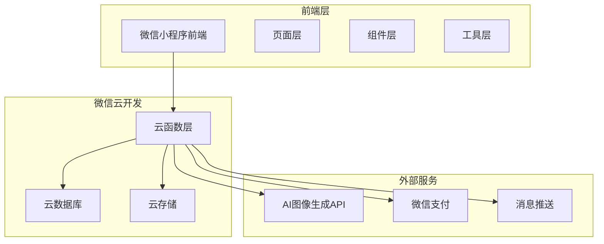

### 前端架构

#### 技术栈
- **框架**: 微信小程序原生开发
- **样式**: WXSS，现代简约风格
- **状态管理**: 全局状态通过App实例管理
- **图片处理**: 云存储结合临时URL

#### 页面架构

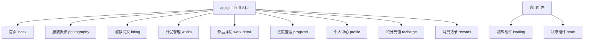

#### 组件设计模式

| 组件类型 | 设计原则 | 示例 |
|---------|---------|------|
| 页面组件 | 业务逻辑封装，数据状态管理 | photography.js |
| 通用组件 | 可复用，无业务耦合 | loading, state |
| 工具类 | 纯函数，职责单一 | api.js, upload.js |

### 后端架构

#### 云函数架构

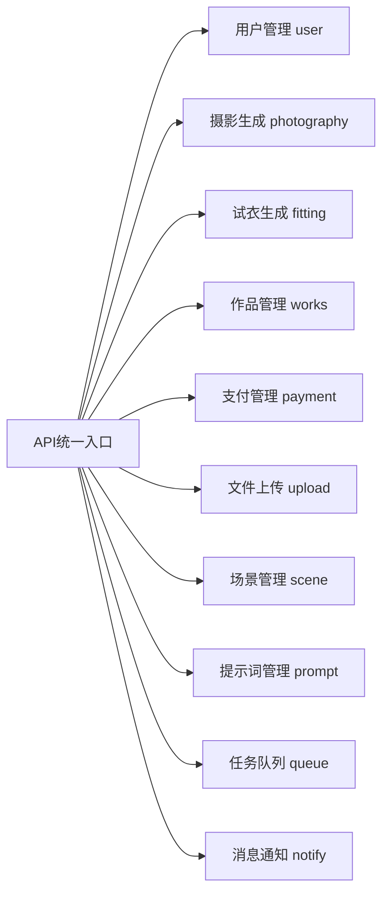

#### 云函数职责分工

| 云函数 | 主要职责 | 核心接口 |
|-------|---------|---------|
| api | 统一API入口，作品管理 | getWorkList, deleteWork, toggleFavorite |
| user | 用户注册登录，信息管理 | register, getUserInfo, updateUserInfo |
| photography | 服装摄影：图片处理+提示词生成+API调用 | generate, getProgress |
| fitting | 虚拟试衣：图片处理+提示词生成+API调用 | generate |
| payment | 积分充值，订单管理 | createOrder, getPackages, dailyCheckin |
| upload | 文件上传到云存储 | uploadFile |
| scene | 场景数据管理 | getScenes |
| prompt | 提示词模板管理与生成 | generatePrompt |
| queue | 异步任务队列处理 | addTask, processTask |
| notify | 消息推送服务 | sendMessage |

### 数据架构

#### 数据库设计

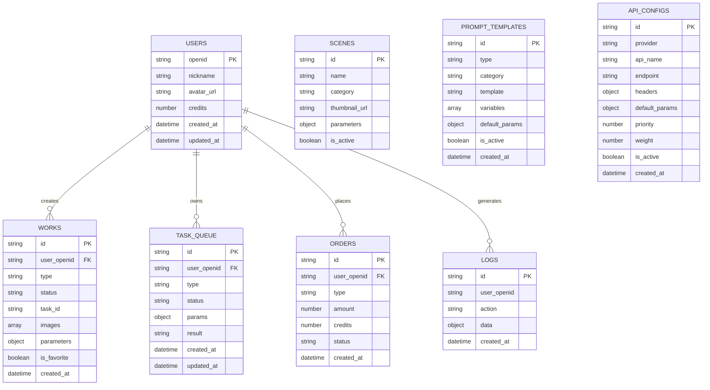

#### 核心数据模型

**用户模型 (users)**
```
{
  openid: string,           // 微信用户唯一标识
  nickname: string,         // 用户昵称
  avatar_url: string,       // 头像URL
  credits: number,          // 积分余额
  invite_code: string,      // 邀请码
  created_at: datetime,     // 创建时间
  updated_at: datetime      // 更新时间
}
```

**作品模型 (works)**
```
{
  _id: string,              // 作品ID
  user_openid: string,      // 用户ID
  type: enum,               // 类型: photography, fitting
  status: enum,             // 状态: pending, processing, completed, failed
  task_id: string,          // 任务ID
  images: array,            // 生成的图片URLs
  parameters: object,       // 生成参数
  scene_id: string,         // 场景ID
  is_favorite: boolean,     // 是否收藏
  created_at: datetime      // 创建时间
}
```

## 核心功能设计

### 1. 用户系统

#### 认证流程

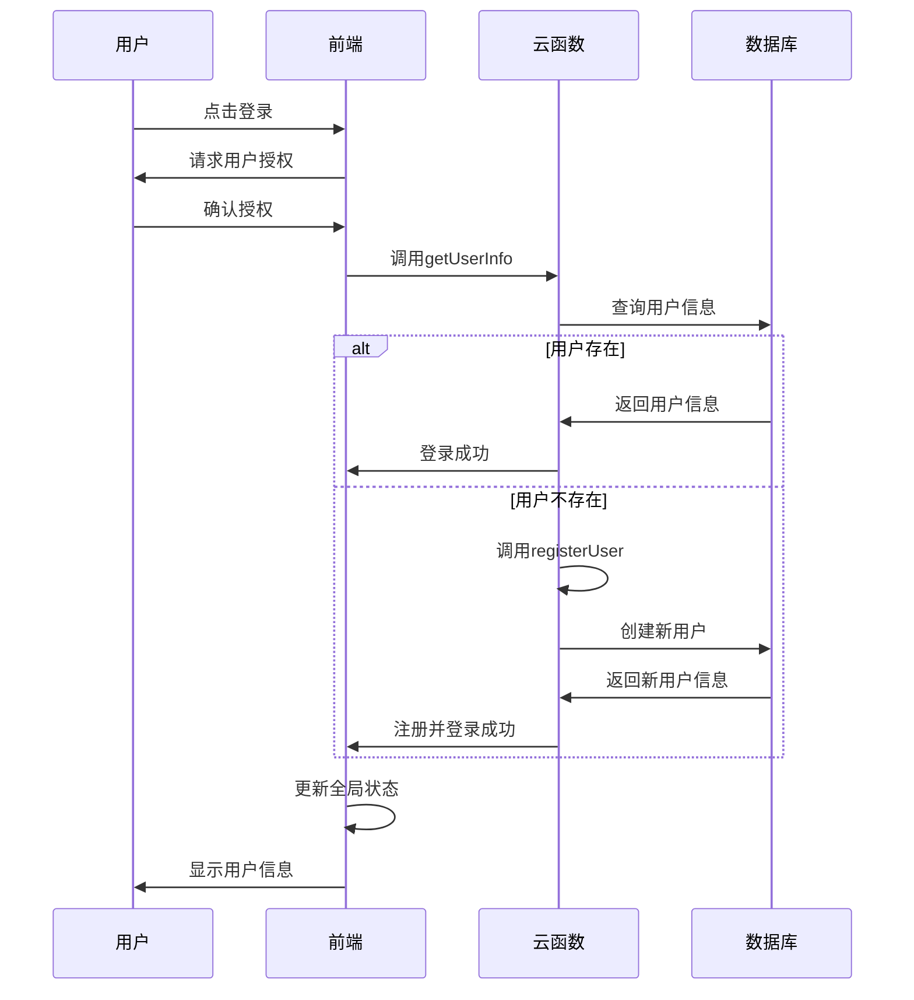

#### 用户信息管理策略

| 策略层面 | 设计方案 | 实现细节 |
|---------|---------|---------|
| 数据同步 | 本地缓存 + 云端同步 | 启动时从本地加载，后台异步刷新 |
| 状态管理 | 全局状态模式 | 通过app.globalData统一管理 |
| 错误处理 | 渐进式降级 | 同步失败时尝试异步，避免阻塞用户体验 |
| 缓存策略 | 智能刷新 | 30秒内防重复刷新，登录状态变化时主动刷新 |

### 2. 服装摄影功能

#### 生成流程设计

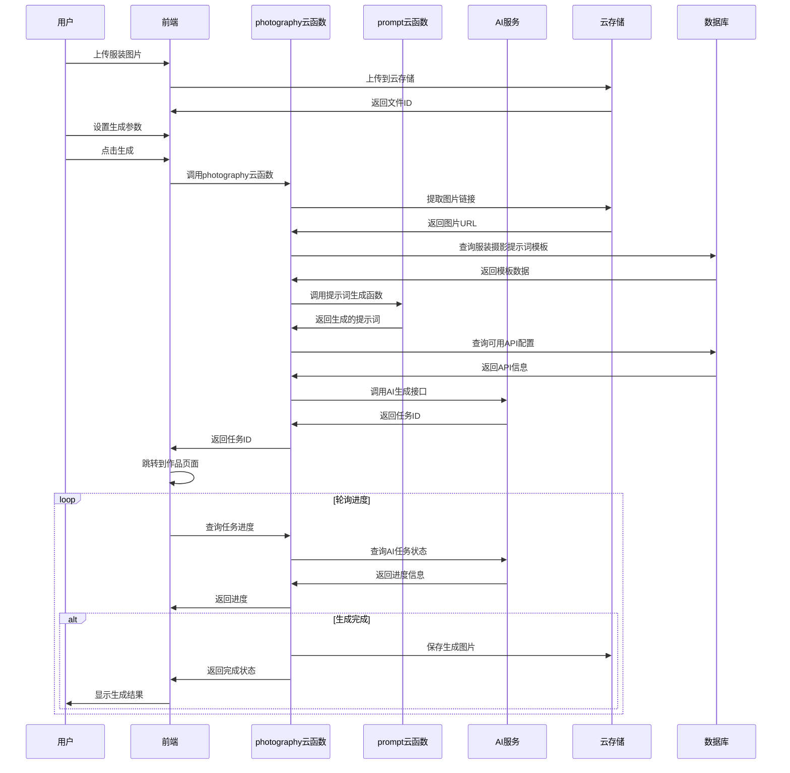

#### 服装摄影云函数核心流程

1. **图片处理阶段**
   - 接收用户上传的服装图片文件ID
   - 从云存储中提取图片的可访问链接
   - 验证图片有效性和格式

2. **提示词生成阶段**
   - 从数据库查询服装摄影类别的提示词模板
   - 调用prompt云函数，传入用户参数和模板
   - 获取动态生成的完整提示词

3. **API调用阶段**
   - 从数据库查询可用的AI API配置
   - 按优先级和权重选择最佳API
   - 发送完整的请求数据到AI服务
   - 处理响应结果和错误

#### 参数配置体系

**基础参数**
- 模特性别 (gender)
- 身高 (height)
- 年龄 (age)
- 国籍 (nationality)
- 肤色 (skin_tone)

**高级参数**
- 服装材质描述 (clothing_material)
- 动作类型 (pose_type)
- 服装搭配描述 (outfit_description)
- 配饰风格 (accessories_style)
- 氛围描述 (mood_and_atmosphere)
- 光照风格 (lighting_style)

**场景管理**
- 预设场景选择
- 自定义场景描述
- 场景参数覆盖

### 3. 虚拟试衣功能

#### 试衣生成逐步流程

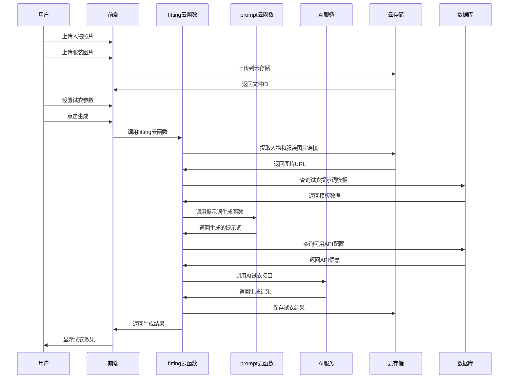

#### 试衣云函数核心流程

1. **图片预处理阶段**
   - 接收用户上传的人物照片和服装图片文件ID
   - 从云存储中获取图片的临时访问链接
   - 验证图片质量和格式符合要求

2. **提示词生成阶段**
   - 从数据库查询试衣类别的提示词模板
   - 调用prompt云函数，传入用户参数和场景信息
   - 生成针对试衣的专用提示词

3. **AI试衣处理阶段**
   - 从数据库获取试衣API的配置信息
   - 按照权重和负载选择最优API服务
   - 组合图片、提示词和参数发送请求
   - 接收并处理AI服务返回的试衣结果

#### 试衣参数设计

| 参数类别 | 参数名称 | 数据类型 | 说明 |
|---------|---------|---------|------|
| 人物参数 | model_image | string | 用户照片文件ID |
| 服装参数 | clothing_images | array | 服装图片文件ID列表 |
| 场景参数 | scene_id | string | 场景ID |
| 生成参数 | count | number | 生成数量 |

### 4. 作品管理系统

#### 作品展示架构

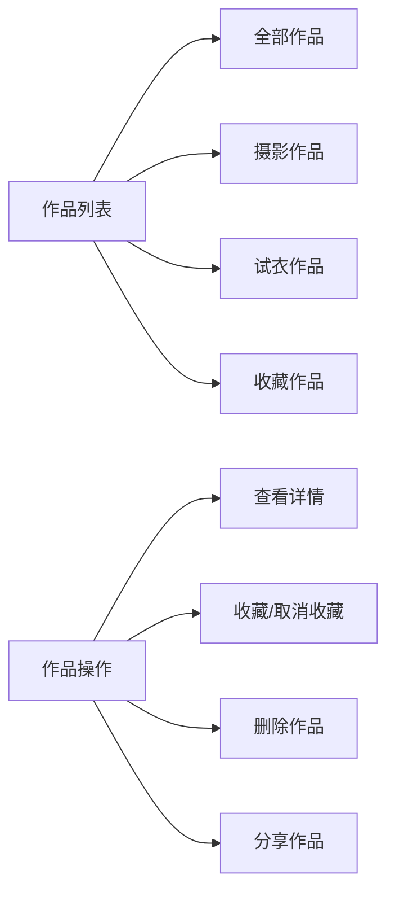

#### 数据加载策略

**分页加载机制**
- 基于 `last_id` 的游标分页
- 每页默认加载12条记录
- 支持下拉刷新和上拉加载更多
- 采用瀑布流布局提升视觉体验

**状态管理**
- 进行中：显示进度条和实时状态
- 已完成：显示缩略图和操作按钮
- 失败：显示错误状态和重试选项

### 5. 积分系统

#### 积分流转模式

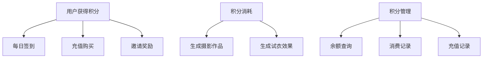

#### 积分定价策略

| 功能类型 | 消耗积分 | 生成数量 | 备注 |
|---------|---------|---------|------|
| 服装摄影 | 1积分/张 | 1-5张 | 基础功能 |
| 虚拟试衣 | 1积分/张 | 1-3张 | 高级功能 |
| 每日签到 | +5积分 | - | 用户留存激励 |

#### 支付集成

**充值套餐设计**
- 基础包：10积分 / ¥9.9
- 标准包：30积分 / ¥19.9
- 专业包：100积分 / ¥49.9
- 企业包：300积分 / ¥99.9

**支付流程**
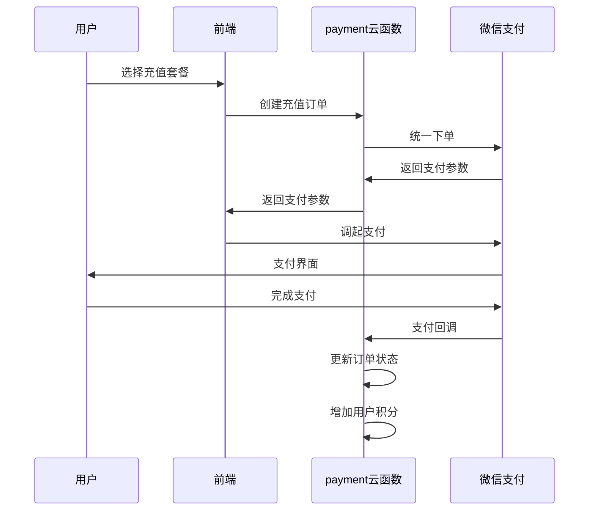

## 提示词系统设计

### 提示词模板管理

#### 模板分类体系

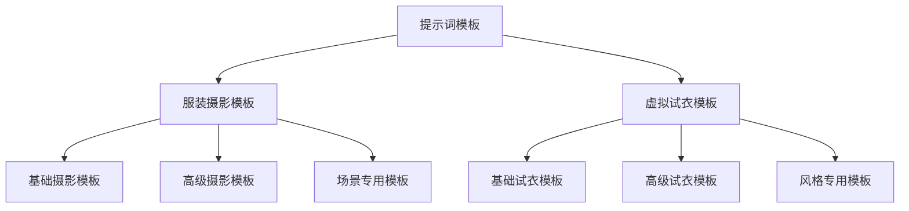

#### 模板数据结构

**提示词模板字段 (prompt_templates)**
```
{
  _id: string,              // 模板唯一标识
  type: enum,               // 类型: photography, fitting
  category: string,         // 分类: 基础/高级/专用
  template: string,         // 模板内容，包含变量占位符
  variables: array,         // 可替换变量列表
  default_params: object,   // 默认参数值
  is_active: boolean,       // 是否启用
  created_at: datetime,     // 创建时间
  priority: number          // 优先级
}
```

#### 提示词生成流程

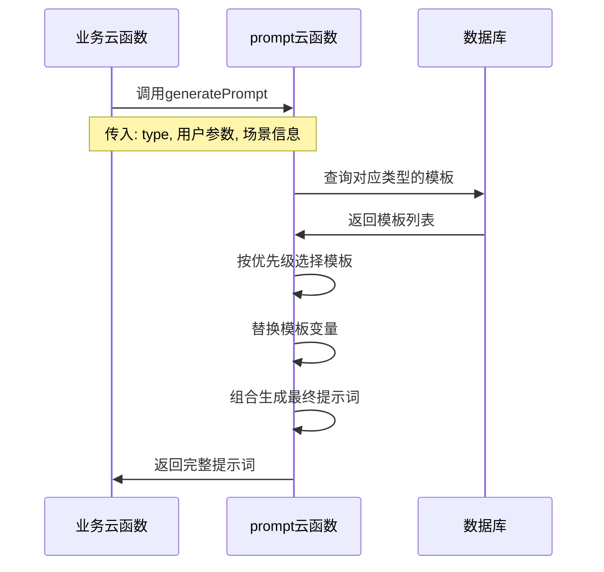

### 变量替换策略

#### 支持的变量类型

| 变量类型 | 格式 | 示例 | 说明 |
|---------|------|------|------|
| 基础参数 | {{param_name}} | {{gender}}, {{age}} | 用户输入参数 |
| 场景参数 | {{scene.param}} | {{scene.name}}, {{scene.lighting}} | 场景相关信息 |
| 条件参数 | {{#if condition}} | {{#if has_accessories}} | 条件显示内容 |
| 默认参数 | {{param\|default}} | {{material\|cotton}} | 带默认值的参数 |

#### 模板示例

**服装摄影模板**
```
A professional fashion photography of {{gender}} model, age {{age}}, 
{{nationality}} ethnicity, {{skin_tone}} skin tone, wearing {{clothing_description}}, 
{{#if scene.name}}in {{scene.name}} setting{{/if}}, 
{{pose_type|dynamic}} pose, {{lighting_style|professional studio lighting}}, 
high fashion, editorial style, 8K resolution, sharp focus
```

**试衣模板**
```
Virtual try-on of {{clothing_type}} on {{model_description}}, 
{{#if scene.background}}with {{scene.background}} background{{/if}}, 
realistic fit and draping, natural lighting, 
high quality rendering, photorealistic result
```

## API管理系统

### API配置管理

#### API配置数据结构

**API配置字段 (api_configs)**
```
{
  _id: string,              // 配置唯一标识
  provider: string,         // 服务提供商名称
  api_name: string,         // API名称标识
  endpoint: string,         // API请求地址
  headers: object,          // 请求头配置
  default_params: object,   // 默认请求参数
  priority: number,         // 优先级 (1-10)
  weight: number,           // 负载均衡权重
  is_active: boolean,       // 是否启用
  rate_limit: object,       // 速率限制配置
  retry_config: object,     // 重试策略
  created_at: datetime      // 创建时间
}
```

#### API选择策略

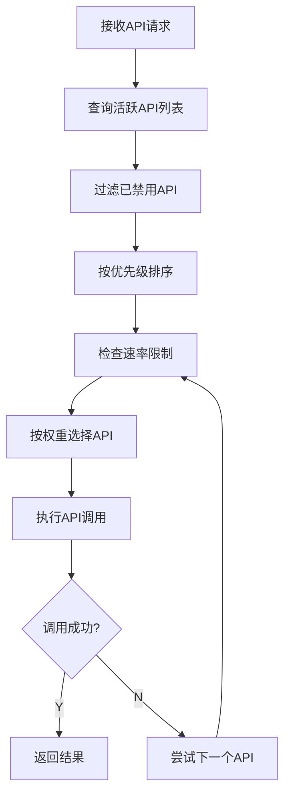

### 容错与重试机制

#### 错误处理策略

| 错误类型 | 处理策略 | 重试次数 | 切换策略 |
|---------|---------|---------|----------|
| 网络超时 | 立即重试 | 3次 | 切换备用API |
| 速率限制 | 等待重试 | 1次 | 切换优先级较低API |
| 认证失败 | 更新token | 1次 | 禁用当前API |
| 服务器错误 | 等待重试 | 2次 | 切换其他提供商 |
| 参数错误 | 立即返回 | 0次 | 记录错误日志 |

#### API负载均衡

**权重分配算法**
- 按照成功率动态调整权重
- 高优先级API获得更多请求机会
- 实时监控API响应时间和可用性

**熔断器机制**
- 连续失败达到阈值时自动熔断
- 定期检查服务恢复状态
- 智能切换到健康的API服务

## API设计规范

### 云函数接口标准
#### 统一响应格式

```
{
  success: boolean,        // 请求是否成功
  data: object | array,    // 响应数据
  message: string,         // 提示信息
  code: string            // 错误码(可选)
}
```

#### 错误处理机制
|---------|---------|---------|
| 网络错误 | 自动重试3次 | "网络连接异常，请检查网络" |
| 参数错误 | 立即返回 | "请求参数有误" |
| 权限错误 | 跳转登录 | "请先登录" |
| 服务器错误 | 记录日志 | "服务繁忙，请稍后重试" |
| 积分不足 | 引导充值 | "积分不足，是否前往充值？" |

### 主要API接口

#### 用户相关接口

**用户注册**
```
输入: {
  action: 'register',
  nickname: string,
  avatar_url: string,
  invite_code: string (可选)
}
输出: {
  success: true,
  data: { user_info: UserInfo },
  message: '注册成功'
}
```

**获取用户信息**
```
输入: {
  action: 'getUserInfo'
}
输出: {
  success: true,
  data: { user_info: UserInfo },
  message: '获取成功'
}
```

#### 生成相关接口

**服装摄影生成**
```
输入: {
  action: 'generate',
  images: string[],        // 服装图片文件ID数组
  parameters: object,      // 生成参数
  sceneId: string,        // 场景ID
  count: number           // 生成数量
}
输出: {
  success: true,
  data: { task_id: string },
  message: '任务已提交'
}
```

**进度查询**
```
输入: {
  action: 'getProgress',
  task_id: string
}
输出: {
  success: true,
  data: {
    status: 'processing' | 'completed' | 'failed',
    progress: number,     // 进度百分比
    images: string[]      // 完成时的图片URLs
  }
}
```

## 异步任务处理

### 任务队列设计

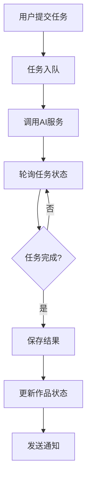

### 进度反馈机制

**实时进度查询**
- 前端每3秒轮询一次任务进度
- 使用静默调用避免频繁显示loading
- 支持多任务并发处理和状态管理

**状态流转**
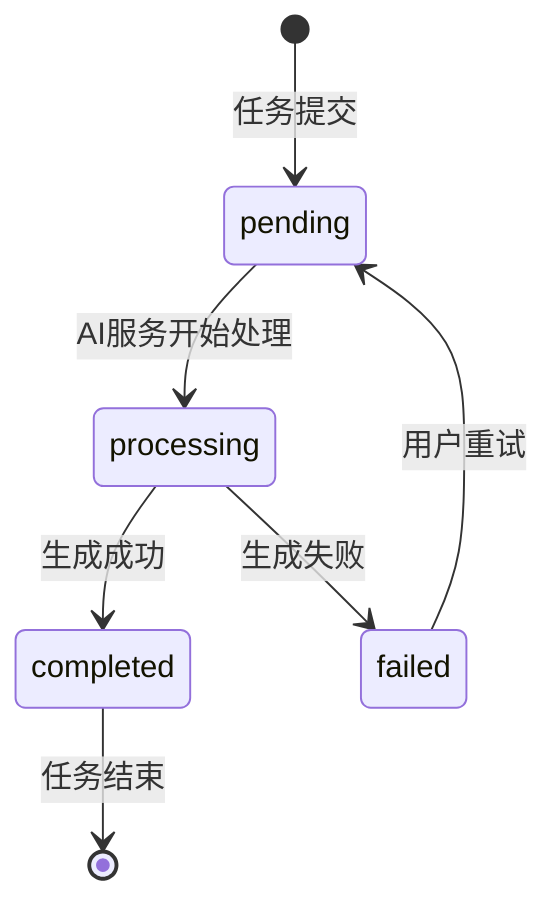

### 容错机制

| 异常情况 | 处理策略 | 恢复方案 |
|---------|---------|---------|
| AI服务超时 | 自动重试 | 切换备用API |
| 网络中断 | 本地缓存任务ID | 页面恢复时继续轮询 |
| 服务器错误 | 记录错误日志 | 人工介入处理 |
| 积分扣除异常 | 事务回滚 | 恢复用户积分 |

## 用户体验设计

### 界面设计原则

**视觉设计**
- 主色调：白色背景配渐变蓝色品牌色 (#4A90E2)
- 布局方式：卡片化设计，层次分明
- 字体规范：系统默认字体，16px主要内容，14px辅助信息
- 图标风格：线性图标，统一风格

**交互设计**
- 操作反馈：所有操作提供即时视觉反馈
- 加载状态：分层加载，关键操作显示进度
- 错误处理：友好的错误提示和引导
- 手势支持：支持下拉刷新、上拉加载

### 性能优化策略

**图片加载优化**
- 使用云存储临时URL减少请求延迟
- 实现图片懒加载和缓存机制
- 缩略图和原图分离加载

**数据加载优化**
- 分页加载降低首屏加载时间
- 预加载用户常用数据
- 本地缓存减少网络请求

**用户体验优化**
- 骨架屏提升感知性能
- 操作预设值减少用户配置成本
- 智能参数推荐

### 响应式设计

**适配策略**
- 基于rpx单位的响应式布局
- 适配不同屏幕尺寸的手机
- 横竖屏切换的兼容处理

## 测试策略

### 功能测试覆盖

**核心功能测试**
- 用户注册登录流程
- 图片上传和管理
- AI生成功能完整流程
- 积分充值和消费
- 作品管理操作

**边界条件测试**
- 网络异常情况处理
- 大文件上传限制
- 高并发访问测试
- 异常数据输入验证

### 性能测试指标

| 测试项目 | 性能指标 | 验收标准 |
|---------|---------|---------|
| 页面加载时间 | 首屏加载 | <2秒 |
| 图片上传 | 3MB图片 | <10秒 |
| AI生成响应 | 任务提交 | <5秒 |
| 进度查询频率 | 轮询间隔 | 3秒 |

### 兼容性测试

**设备兼容性**
- iOS 系统兼容性测试
- Android 系统兼容性测试  
- 不同分辨率屏幕适配

**微信版本兼容性**
- 最低支持微信版本：7.0.0
- 小程序基础库版本：2.2.3+
- 云开发功能兼容性验证